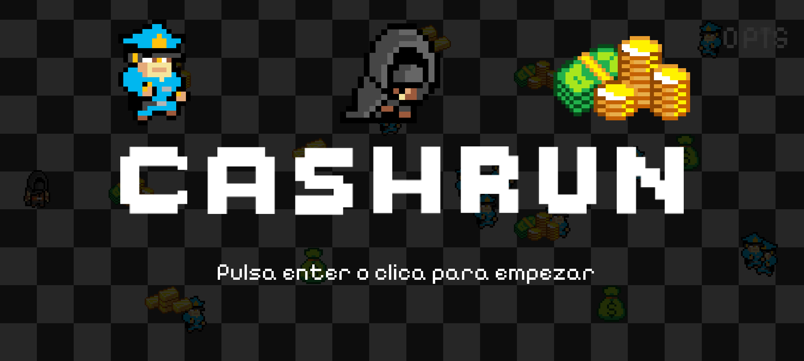
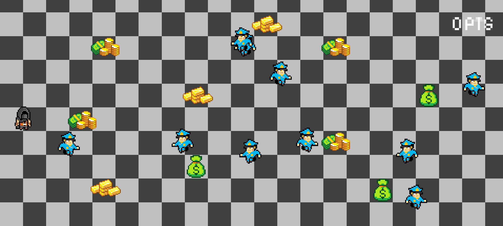
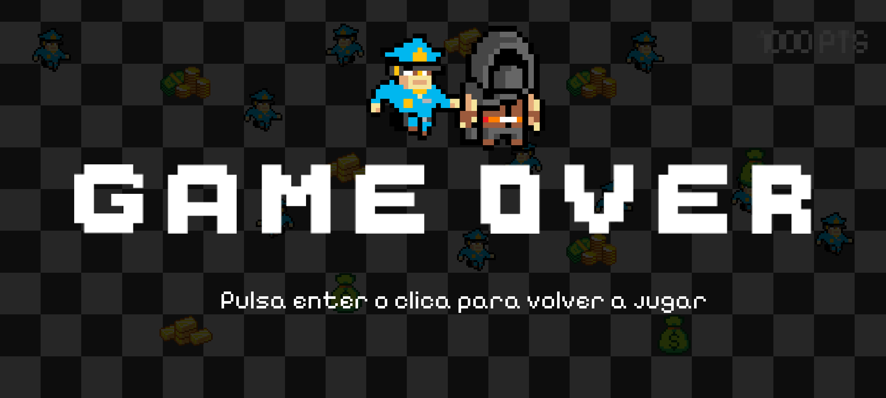

# Cashrun

**Cashrun** is a video game developed in **Java** using **Android Studio**. The game simulates a bank robbery where a thief must avoid getting caught by guards while collecting all the money scattered across the map.

---

## 🎮 Concept

Cashrun is based on the premise of a thief entering a bank with the goal of collecting all the money distributed throughout the map.

The game map simulates the interior of a bank protected by multiple security guards who patrol and monitor areas with money to prevent theft.

---

## 🎯 Objective

The main goal for the player is to control the thief and collect all the money scattered in the bank while avoiding capture by the guards.

- **Win Condition:** Collect minimum a money item and arrive to the other side of the map without being caught.
- **Lose Condition:** Collide with any security guard, which ends the game immediately.

---

## ⚙️ Mechanics

### Player Movement
- The thief can move in four directions: up, down, left, and right.
- Free movement within the map boundaries.
- Must avoid guard patrol routes.

### Enemy Movement
- Guards patrol predefined paths around the map.
- They move in eight directions, including diagonals (up, down, left, right, and diagonals).
- Their purpose is to block or intercept the player.

### Lose Condition
- Collision with any guard results in an immediate loss.

### Win Condition
- Collect all the money without being caught.

---

## 🎮 Controls

- **Touchscreen:** Swipe gestures to move the thief (primary control method).
- **Keyboard:** Arrow keys for movement.
- **Mouse:** Click or drag to direct the thief’s movement.

---

## 🖼 Screenshots

  

  

---

## 📂 Project Structure

- Developed with Java and Android Studio.
- Includes classes for player, guards, map, and collision logic.
- Guards patrol with custom behaviors.
- Supports touch, keyboard, and mouse controls.

---

## 💻 Requirements

- Android Studio (version X.X or higher)
- JDK 8 or higher

---

## 📋 How to Run

1. Clone the repository.
2. Open the project in Android Studio.
3. Run on an Android device or emulator.
